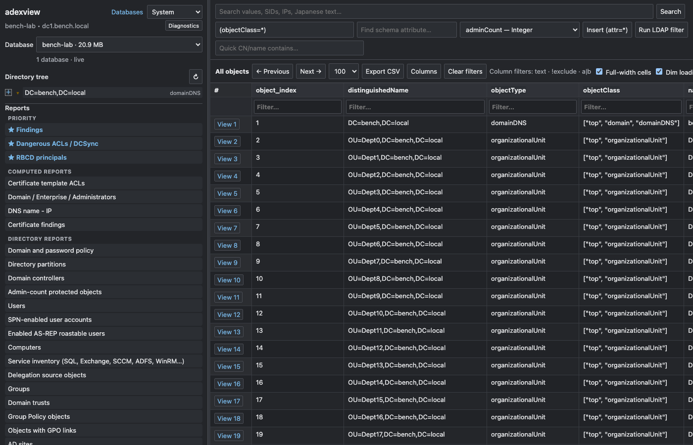
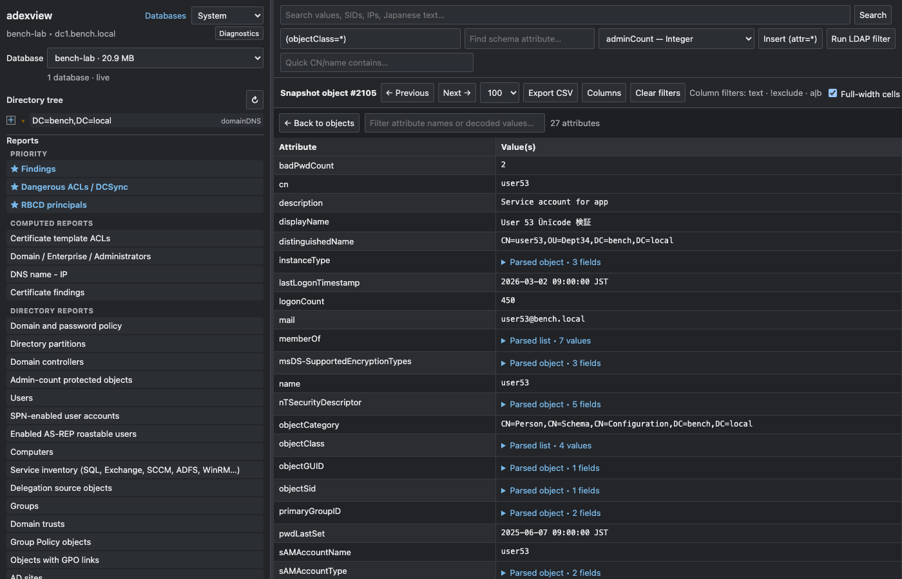
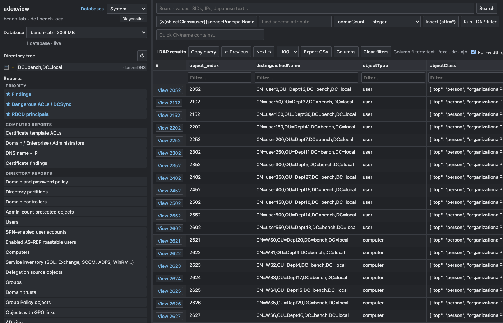
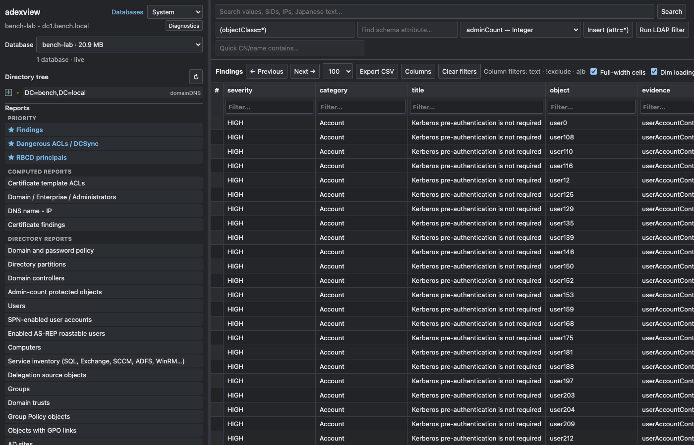
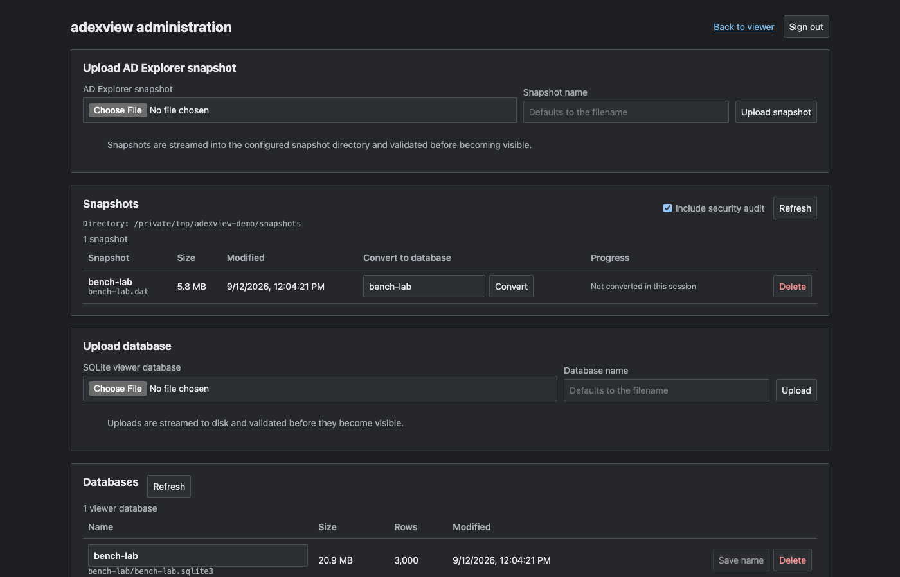

# adexview

Browse, search and audit an AD Explorer snapshot from any machine, offline.

You take a snapshot of Active Directory with Sysinternals AD Explorer (or with
its companion collector, adexsnap, from Linux or macOS).
adexview turns that `.dat` file into a searchable database and serves it in
your browser: the directory tree, every attribute decoded, LDAP filters, and a
set of reports for the things BloodHound does not tell you, like subnets, DNS
name-to-IP maps, DFS shares, GPO links, LAPS coverage, certificate templates
and trusts. Nothing ever talks to a domain controller.



It runs on the Python standard library. `pip install` it, point it at a
snapshot, and open the link it prints.

> [!CAUTION]
> A snapshot and the databases built from it can hold password material, LAPS
> and BitLocker recovery data, ACLs and other sensitive data. Use only snapshots
> you are authorised to inspect and treat every generated file like the
> snapshot itself.

## Install

Clone it and run it in place, like adexsnap:

```bash
git clone https://github.com/<you>/adexview
cd adexview
python3 -m venv .venv && source .venv/bin/activate
python3 -m pip install -r requirements-optional.txt   # optional: Excel export, X.509 decoding
./view.sh snapshot.dat
```

Or install it as a command so `adexview` works from any directory:

```bash
python3 -m pip install ".[full]"
adexview view snapshot.dat
```

Python 3.10 or newer; nothing beyond the standard library is required.

## Three ways to use it

**Just open a snapshot.** The first run builds a database next to the file and
prints a login password and the address to open. Indexing runs in the
background while you browse; add `--open-browser` to have it launch your
browser.

```bash
adexview view snapshot.dat
```

**Run the audit first, then browse it.** The audit adds the Findings, ACL,
RBCD, DNS and certificate reports to the database.

```bash
adexview audit --snapshot snapshot.dat --output db/customer-a
adexview view db/customer-a
```

**Serve a library of databases.** Every database below the directory shows up
in a selector, and the Databases page lets you upload a snapshot, convert it
with or without the audit, and delete it when the engagement is over.

```bash
adexview view --library /data/adexview
```

`view.sh` and `enum.sh` in the repository wrap the first and second commands
with the same arguments as before.

## What you get in the browser

**The tree and the objects.** The left pane mirrors AD Explorer with the
domain, Configuration and Schema roots. Click any object and every attribute is
decoded: flags become names, timestamps become dates in your timezone, SIDs and
GUIDs are resolved, security descriptors are expanded ACE by ACE, DNS records
and DFS targets are parsed. Links to other objects (member, memberOf,
managedBy, SIDs) resolve with one click.



**Search.** The top box searches every decoded value, including Unicode text.
The LDAP row accepts the filters you already know, with `&`, `|`, `!`,
wildcards, `>=` and `<=`, and the AD bitwise rules, plus a virtual
`objectType` attribute so `(objectType=computer)` just works.



**Reports.** The sidebar lists computed reports from the audit and a saved
LDAP query for every directory report: domain controllers, SPN accounts,
AS-REP roastable users, delegation, groups, trusts, GPOs, sites and subnets,
DNS nodes, shares and DFS, certificate authorities and templates, managed
service accounts, LAPS and BitLocker objects, schema extensions, sensitive
attributes and free-text fields. "Custom attributes in use" shows which schema
extensions actually carry data, on how many objects, with sample values; the
Query button on each row lists every object that populates the attribute.
"Sensitive attributes checklist" does the same for password and recovery
attributes.



Every table sorts, filters per column (`text`, `=exact`, `!exclude`, `a|b`,
`>=10`), pages, and exports to CSV. A link like `/#row=1234` or
`/#report=findings` opens a specific object or report.

## Login and exposure

adexview asks for a password by default, because a snapshot is the whole
directory. Each start prints a fresh one unless you set your own:

```bash
adexview view snapshot.dat --password 'a-long-one'
adexview view snapshot.dat --password-file ~/.adexview-password
ADEXVIEW_PASSWORD=... adexview view snapshot.dat
```

Sessions are HttpOnly, same-site cookies that expire after 12 idle hours, and
failed logins are throttled. On the default `127.0.0.1` bind the server also
refuses requests for other host names, which keeps DNS-rebinding pages away
from it. `--no-auth` turns the login off and is only accepted on a loopback
address, so a server on `0.0.0.0` always has a password.

For HTTPS pass a PEM certificate and key; TLS 1.2 or newer is enforced:

```bash
adexview view --library /data/adexview --host 0.0.0.0 --port 8443 \
  --tls-cert fullchain.pem --tls-key private-key.pem
```

The password protects the web interface only. The database files on disk are
plain SQLite; keep them on an encrypted volume and delete them when you are
done.

## The Databases page



In library mode, logged-in users can upload a `.dat` snapshot, convert it into
a database in the background (with a progress bar), upload a database built
elsewhere, rename, and delete. Conversions are published only when complete,
uploads are validated before they appear, and everything stays inside the two
configured directories. Pass `--no-admin` to make the library read-only.

## The audit

```bash
adexview audit --snapshot snapshot.dat --output db/customer-a               # database with reports
adexview audit --snapshot snapshot.dat --output db/customer-a --csv-reports # also CSV files
adexview audit --snapshot snapshot.dat --output db/customer-a --output-mode csv
adexview audit --snapshot snapshot.dat --output db/customer-a --redact-sensitive-values
adexview audit --snapshot snapshot.dat --output db/customer-a --timezone UTC --stale-days 120
```

The audit reads the snapshot once and writes `00_summary.md`, `metadata.json`
and, by default, the viewer database with the computed tables. With
`--csv-reports` you also get a folder of CSV files grouped by area, encoded as
UTF-8 with a BOM so they open cleanly in Excel.

What it looks for: weak domain password and lockout policy, machine-account
quota, accounts without Kerberos pre-authentication or with reversible or DES
passwords, never-expiring passwords, unconstrained and resource-based
delegation, stale users and computers, secrets typed into description fields,
dangerous ACLs on privileged objects (GenericAll, WriteDacl, WriteOwner,
AddMember, WriteSPN, DCSync rights on the domain head), Kerberos encryption
types, external trusts without SID filtering, RC4 trusts, SIDHistory, LAPS
coverage and who can read the passwords, key credentials on sensitive
principals, privileged-account hygiene, and AD CS templates with ESC1 to ESC5
conditions or weak keys.

Passwords and recovery keys found in the snapshot are included as captured so
you can prove exposure. Use `--redact-sensitive-values` before handing a
bundle to someone else.

## LDAP from the command line

```bash
adexview query --snapshot snapshot.dat \
  --filter '(&(objectClass=user)(servicePrincipalName=*))' \
  --attributes sAMAccountName servicePrincipalName pwdLastSet --format csv --output spn.csv

adexview query --snapshot snapshot.dat --filter '(badPwdCount>=3)' --attributes sAMAccountName
```

Formats: `table`, `csv`, `json`, `excel`. Add `--raw-values` to skip decoding
and `--benchmark` to print scan statistics.

## How big and how fast

Measured on an Apple Silicon laptop with a synthetic 150,000-object, 205 MB
snapshot from `tools/make_synthetic_snapshot.py`:

| Operation | Time | Peak memory | Result |
| --- | ---: | ---: | --- |
| Build the viewer database | 28 s | 0.4 GB | 1.1 GB database |
| Full audit | 15 s | 0.9 GB | |
| CLI full scan `(objectClass=*)` | 0.8 s | | |

Both scale linearly with the number of objects. For large snapshots:

- expect a database 2 to 5 times the snapshot size, and keep it on local SSD;
- the audit keeps the attributes it needs for every object in memory, roughly
  5 GB of RAM per 1 GB of snapshot, so build very large audited databases on a
  workstation and upload the result to the library;
- copy only closed databases (no `-wal` file next to them);
- searches need at least three characters to use the index.

Run one server process; sessions and caches are in memory.

## Development

```text
src/adexview/
├── snapshot.py      AD Explorer .dat reader (memory-mapped, bounds-checked)
├── ldapfilter.py    RFC 4515 filter parser and evaluator
├── query.py         streaming query engine
├── decoders.py      ACL, DNS, DFS, certificate, flag and timestamp decoders
├── index.py         SQLite schema and snapshot indexer
├── search.py        query planning over the index
├── library.py       database discovery, validation and naming
├── auth.py          password sessions
├── server.py        HTTP API and administration
├── cli.py           adexview view | audit | query
├── audit/           records, analyses, reports, orchestration
└── static/          viewer, admin and login pages
tests/               unit, HTTP and end-to-end tests on a synthetic snapshot
tools/               synthetic snapshot generator for benchmarks
```

```bash
python3 -m unittest discover -s tests -t .
python3 tools/make_synthetic_snapshot.py /tmp/big.dat 150000
```

## Why this exists, and thanks

On most engagements I end up with an AD Explorer snapshot and a list of
questions BloodHound does not answer: which subnets exist, what a DNS name
resolves to, where the DFS shares point, which GPOs are linked where, whether
LAPS actually covers the fleet, what the certificate templates allow. AD
Explorer answers them, but only one object at a time, only on Windows, and
only for whoever holds the file.

The starting point was [adx-query](https://github.com/takito1812/adx-query) by
Víctor García ([@takito1812](https://github.com/takito1812)), an offline LDAP
query engine for AD Explorer snapshots. It showed that a snapshot can be
treated as a queryable directory without ever touching a domain controller,
and that idea is the base everything here is built on. Thank you, Víctor. The
query engine, output formatters and query CLI are still derived from that
work; the snapshot reader and filter engine were rewritten along the way, and
the audit, the SQLite index, the web viewer and the library administration
were added on top. The snapshot format knowledge also builds on
[ADExplorerSnapshot.py](https://github.com/c3c/ADExplorerSnapshot.py) by
Cedric Van Bockhaven. [NOTICE.md](NOTICE.md) records the file-level lineage.

## License

MIT. The original copyright notice from adx-query is preserved in
[LICENSE](LICENSE) next to this project's own, as the license requires.

AD Explorer is a Microsoft Sysinternals product. adexview is an independent
offline parser of the files it produces and is not affiliated with or endorsed
by Microsoft or by the authors of the projects named above.
